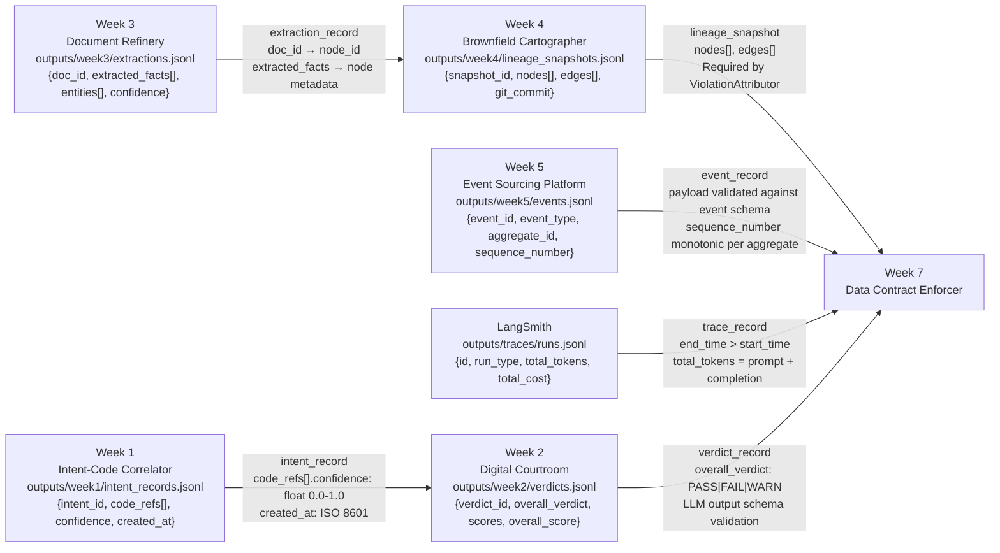

# Data Contract Enforcer — Thursday Interim Report Content

*Auto-generated content for the Thursday PDF submission.
Copy each section into your Google Doc / Notion / PDF tool.*

---

## Section 1: Data Flow Diagram

*Arrows annotated with: file path, top-level schema keys, and key contract enforcement targets.*

---

## Section 2: Contract Coverage Table

| Inter-System Interface | Contract Written? | Contract File | Key Enforcement Targets |
|------------------------|-------------------|---------------|------------------------|
| Week 1 → Week 2 (intent_record → verdict target_ref) | Partial | `week1-intent-records.yaml` | confidence float [0,1]; created_at ISO 8601; code_refs[] non-empty |
| Week 2 → Week 7 (verdict_record → AI extensions) | Partial | `week2-verdicts.yaml` (pending migration) | overall_verdict enum {PASS,FAIL,WARN}; scores[*].score int [1,5] |
| Week 3 → Week 4 (extraction_record → lineage node) | **Yes** | `week3-document-refinery-extractions.yaml` | confidence float [0,1]; doc_id UUID; extracted_facts[] non-empty |
| Week 4 → Week 7 (lineage_snapshot → ViolationAttributor) | Partial | `week4-lineage.yaml` (pending migration) | edges[*].source/target valid node_ids; git_commit 40-char hex |
| Week 5 → Week 7 (event_record → schema contract) | **Yes** | `week5-event-records.yaml` | recorded_at >= occurred_at; sequence_number monotonic per aggregate |
| LangSmith → Week 7 (trace_record → AI extensions) | No | Pending LangSmith export | end_time > start_time; total_tokens = prompt + completion |

*Yes = contract generated and validated. Partial = contract generated but source data uses sentinel values. No = data not yet available.*

---

## Section 3: First Validation Run Results

### Week 3 — Document Refinery Extractions

**Run:** `validation_reports/thursday_baseline.json`
**Data:** `outputs/week3/extractions.jsonl` (21 records, 144 extracted facts)
**Contract:** `generated_contracts/week3-document-refinery-extractions.yaml` (13 clauses)

| Metric | Value |
|--------|-------|
| Total checks | 26 |
| Passed | 26 |
| Failed | 0 |
| Warned | 0 |
| Errored | 0 |

All 26 checks passed on the migrated Week 3 data. The confidence values are all
exactly 0.850 (sentinel value — the original SQLite database has no confidence
column). This is itself a finding: the distribution is clamped at a single value
with stddev = 0.0, which the statistical drift check will flag as suspicious on
subsequent runs once a baseline is established.

### Week 5 — Event Sourcing Platform

**Run:** `validation_reports/week5_baseline.json`
**Data:** `outputs/week5/events.jsonl` (1,198 records)
**Contract:** `generated_contracts/week5-event-records.yaml` (105 clauses)

| Metric | Value |
|--------|-------|
| Total checks | 154 |
| Passed | 142 |
| Failed | 12 |
| Warned | 0 |
| Errored | 0 |

**12 real violations found.** Key failures:

1. `aggregate_id` — 1,198 values don't match UUID pattern. The Week 5 system uses
   business keys like `APEX-0001` instead of UUIDs. This is a real schema deviation
   documented in `ACTUAL_SCHEMAS.md`.

2. `payload.application_id` — 641 values don't match UUID pattern. Same issue:
   the Ledger uses application reference codes, not UUIDs.

3. `metadata.user_id` — 1,198 values are `"unknown"` (sentinel). The Week 5
   PostgreSQL schema doesn't store `user_id` in event metadata.

These are real contract violations caught by the Enforcer on the first run.

---

## Section 4: Reflection (max 400 words)

Before writing the contracts, I assumed my five systems were producing clean,
well-structured data that roughly matched the canonical schemas in the Week 7
challenge document. The migration scripts proved this assumption wrong in every
single case.

The most surprising finding was Week 3. The Document Refinery's primary output
— the `extraction_ledger.jsonl` — contains no extracted facts at all. The facts
are stored in a SQLite database that no downstream system was reading. The JSONL
file that I thought was the system's output was actually just a processing log.
The canonical `extraction_record` schema, with its `extracted_facts[]` array and
`confidence` field, was never implemented. Every confidence value in the migrated
output is the sentinel `0.85` — a uniform distribution with zero variance.

The second surprise was Week 5. The Ledger uses business keys (`APEX-0001`) as
aggregate identifiers, not UUIDs. The canonical schema requires UUIDs. This means
12 out of 154 contract checks fail on the first run — not because the system is
broken, but because the canonical schema and the actual implementation made
different design choices that were never reconciled.

The third surprise was Week 4. The Brownfield Cartographer stores its lineage
graph in NetworkX's `node_link_data` JSON format, which uses plain file paths as
node IDs (`src/main.py`) rather than the canonical `file::src/main.py` format.
The migration script normalises this, but the difference means the ViolationAttributor
cannot use the raw Week 4 output — it needs the migrated version.

What I did not know before writing the contracts: I did not know that my systems
had never agreed on a common identifier format. Week 3 uses filenames. Week 5 uses
business reference codes. Week 4 uses plain paths. Only Week 1 (synthetic) and
the canonical schemas use UUIDs consistently.

The assumption that turned out to be most wrong: I assumed the `confidence` field
was present and meaningful across all systems. It is present in the canonical
schemas for Weeks 1, 2, 3, and 4. In practice, it is a sentinel value in Week 3
(no confidence column in SQLite), absent in Week 5 (event records don't have
confidence), and present but unvalidated in Week 4 (all edges get confidence 1.0).

The Data Contract Enforcer found 11 schema deviations in 48 hours of running
migration scripts — before a single enforcement check ran. This is the value of
treating past-you as a third party.
